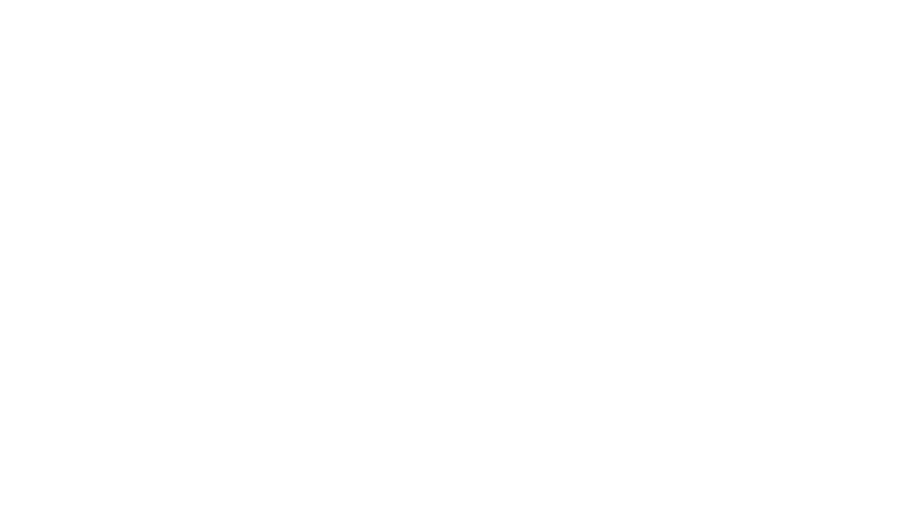
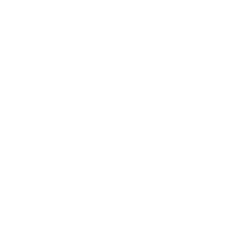

# LIT Lab logo

Below are previews and links to PNG and SVG versions of the current LIT Lab logo.

<table>
  <thead>
    <tr>
      <td width="10%"></td>
      <th width="30%">Regular</th>
      <th width="30%">Inverted</th>
      <th width="30%">White</th>
    </tr>
  </thead>
  <tbody>
    <tr>
      <th>Large</th>
      <td style="background-color: white">
        
        <a href="./current-logo/png/lit-lab-logo-large.png">PNG</a> <a href="./current-logo/svg/lit-lab-logo-large.svg">SVG</a>
      </td>
      <td style="background-color: #15284b">
        
        <a href="./current-logo/png/lit-lab-logo-large-inverted.png">PNG</a> <a href="./current-logo/svg/lit-lab-logo-large-inverted.svg">SVG</a>
      </td>
      <td style="background-color: #15284b">
        
        <a href="./current-logo/png/lit-lab-logo-large-white.png">PNG</a> <a href="./current-logo/svg/lit-lab-logo-large-white.svg">SVG</a>
      </td>
    <tr>
    <tr>
      <th>Stacked</th>
      <td style="background-color: white">
        
        <a href="./current-logo/png/lit-lab-logo-stacked.png">PNG</a> <a href="./current-logo/svg/lit-lab-logo-stacked.svg">SVG</a>
      </td>
      <td style="background-color: #15284b">
        
        <a href="./current-logo/png/lit-lab-logo-stacked-inverted.png">PNG</a> <a href="./current-logo/svg/lit-lab-logo-stacked-inverted.svg">SVG</a>
      </td>
      <td style="background-color: #15284b">
        
        <a href="./current-logo/png/lit-lab-logo-stacked-white.png">PNG</a> <a href="./current-logo/svg/lit-lab-logo-stacked-white.svg">SVG</a>
      </td>
    <tr>
    <tr>
      <th>Small</th>
      <td style="background-color: white">
        
        <a href="./current-logo/png/lit-lab-logo-small.png">PNG</a> <a href="./current-logo/svg/lit-lab-logo-small.svg">SVG</a>
      </td>
      <td style="background-color: #15284b">
        
        <a href="./current-logo/png/lit-lab-logo-small-inverted.png">PNG</a> <a href="./current-logo/svg/lit-lab-logo-small-inverted.svg">SVG</a>
      </td>
      <td style="background-color: #15284b">
        
        <a href="./current-logo/png/lit-lab-logo-small-white.png">PNG</a> <a href="./current-logo/svg/lit-lab-logo-small-white.svg">SVG</a>
      </td>
    <tr>
    <tr>
      <th>Torch</th>
      <td style="background-color: white">
        
        <a href="./current-logo/png/lit-lab-torch.png">PNG</a> <a href="./current-logo/svg/lit-lab-torch.svg">SVG</a>
      </td>
      <td style="background-color: #15284b">
        
        <a href="./current-logo/png/lit-lab-torch-inverted.png">PNG</a> <a href="./current-logo/svg/lit-lab-torch-inverted.svg">SVG</a>
      </td>
      <td style="background-color: #15284b">
        
        <a href="./current-logo/png/lit-lab-torch-white.png">PNG</a> <a href="./current-logo/svg/lit-lab-torch-white.svg">SVG</a>
      </td>
    <tr>
    <tr>
      <th>Favicon</th>
      <td style="background-color: white">
        
        <a href="./current-logo/png/lit-favicon.png">PNG</a> <a href="./current-logo/svg/lit-favicon.svg">SVG</a>
      </td>
    <tr>
  </tbody>
</table>
